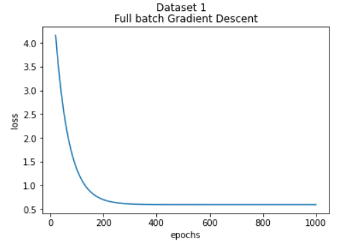
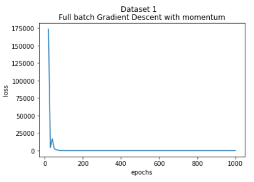

# Q1 Gradient Descent

  
  

## Full batch Gradient descent on Dataset 1

  
  

## Full batch Gradient descent on Dataset 2

  
  

## Stochastic Gradient descent on Dataset 1

  
  

## Stochastic Gradient descent on Dataset 2

  
  

## Full batch Gradient descent with momentum on Dataset 1

  
  

## Full batch Gradient descent with momentum on Dataset 2

  
  

## Stochastic Gradient descent with momentum on Dataset 1

  
  

## Stochastic Gradient descent with momentum on Dataset 2

  
  

## Result

#### * Which dataset and optimizer takes a larger number of epochs to converge, and why?
Full batch gradient descent on dataset 2 takes a larger number of epochs to converge because dataset 2 is more scattered from true function than dataset 1. A more scattered dataset may have a wider range of patterns and variations that the model needs to learn, which could require more iterations through the data to capture most precise theta values. Also stochastic gradient descent often converges faster than full batch gradient descent, especially in the early stages of training. The more frequent updates allow the model to adapt quickly to the training data. So if number of features and samples are very large then for faster computational time stochastic gradient descent is used.

